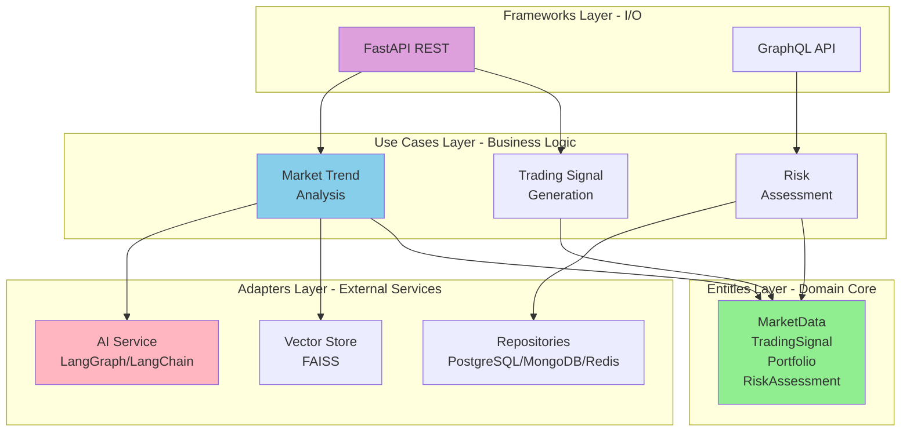
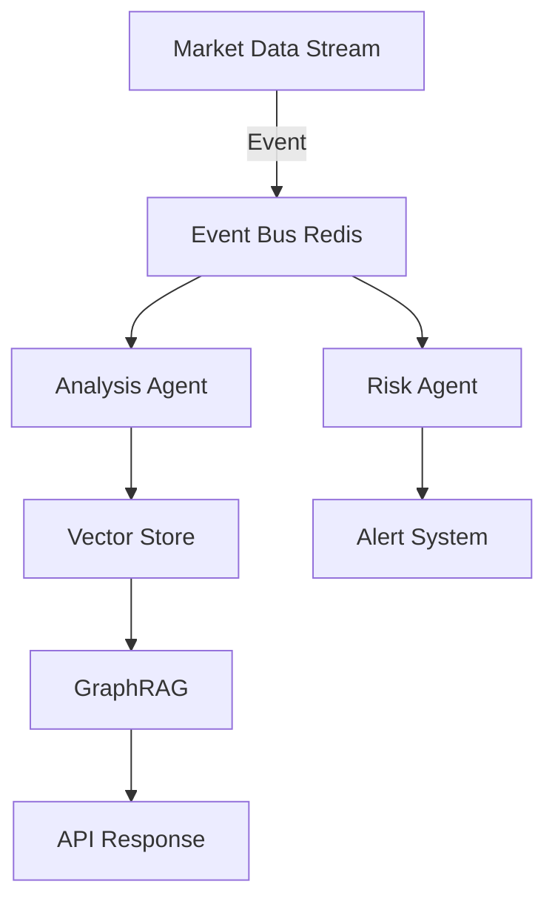

# 🚀 FinanceAI - Intelligent Financial Market Analysis Platform

[](https://www.python.org/downloads/)
[](https://fastapi.tiangolo.com/)
[](https://blog.cleancoder.com/uncle-bob/2012/08/13/the-clean-architecture.html)
[](https://coverage.readthedocs.io/)
[](LICENSE)


---

## 📖 About the Project

**FinanceAI** is an advanced financial market analysis and prediction platform that combines:
- 🤖 **Agentic AI** (LangGraph, LangChain)
- 📊 **GraphRAG** for knowledge graph-based retrieval
- 💾 **Multi-Database Architecture** (PostgreSQL + MongoDB + Redis)
- 🎯 **Clean Architecture** with full SOLID principles compliance
- 🧪 **Test Coverage ≥90%**


---

## 🎯 Why This Project Matters?

This project is a comprehensive example of:

### ✅ Backend Development Excellence
- **FastAPI** با async/await patterns
- **GraphQL** با Strawberry
- **REST API** design با OpenAPI documentation
- **Dependency Injection** با Lagom

### ✅ Clean Architecture Mastery
```
Frameworks → Adapters → Use Cases → Entities
(Outer)    →          →            → (Core Domain)
```
- 🔒 **Strict dependency rules**: Inner layers know nothing about outer layers
- 🎯 **Single Responsibility**: Each component has a single responsibility
- 🔄 **Dependency Inversion**: Use cases depend on interfaces, not implementations

### ✅ AI/ML Integration
- **LangGraph**: Multi-agent workflows
- **LangChain**: Prompt engineering & orchestration
- **GraphRAG**: Knowledge graph + vector search
- **FAISS**: Semantic search with embeddings (free and local)
- **OpenAI/Gemini**: LLM integration

### ✅ Domain-Driven Design
- **Entities**: Pure domain models with business rules
- **Value Objects**: Immutable objects
- **Aggregates**: Portfolio, TradingSignal, RiskAssessment
- **Bounded Contexts**: Market Analysis, Trading, Risk Management
- **Ubiquitous Language**: Precise naming of domain concepts

---

## 🏗️ Architecture Overview



### Dependency Rules (CRITICAL)
```python
# ✅ ALLOWED: Outer → Inner
from vakarno_ai.use_cases.interfaces import AIServiceInterface

# ❌ FORBIDDEN: Inner → Outer
# entities CANNOT import use_cases
# use_cases CANNOT import adapters (only interfaces)

# ✅ CORRECT: Use case depends on interface
class MarketTrendAnalysisUseCase:
    def __init__(
        self,
        ai_service: AIServiceInterface,  # Interface
    ):
        ...

# ✅ CORRECT: Adapter implements interface
class AIServiceAdapter(AIServiceInterface):
    async def process_prompt(self, ...):
        # Implementation using LangChain
```

---

## 🎯 Overview
FinanceAI is an advanced AI-powered financial analysis platform that combines cutting-edge machine learning, agentic AI frameworks, and real-time data processing to provide intelligent insights for financial markets.

## 🏗️ Architecture
Built on **Clean Architecture** principles with strict dependency rules:
- **Entities Layer**: Pure business models (Pydantic)
- **Use Cases Layer**: Application logic with domain interfaces
- **Adapters Layer**: External service implementations (AI, DB, APIs)
- **Frameworks Layer**: FastAPI REST + GraphQL + Event handlers

## 🌟 Key Features Implemented

### 🤖 Agentic AI System
```python
# Multi-agent workflow with LangGraph
- Analyst Agent: Market data analysis
- Predictor Agent: Trend prediction
- Risk Evaluator Agent: Risk assessment
- Coordinator: Agent coordination
```

### 📊 GraphRAG (Graph + Retrieval Augmented Generation)
```
Knowledge Graph Structure:
(Asset)-[:HAS_PRICE]->(PricePoint)
(Asset)-[:CORRELATES_WITH]->(Asset)
(Signal)-[:BASED_ON]->(Indicator)

→ Semantic search with FAISS (local vector DB)
→ Graph traversal for context
→ LLM generation with enriched data
```

### 🎯 Core Business Capabilities
- ✅ Market trend analysis with AI
- ✅ Trading signal generation
- ✅ Portfolio risk assessment
- ✅ Real-time data processing
- ✅ Sentiment analysis integration

---

## 🛠️ Tech Stack & Architecture

### Backend Framework
| Technology | Purpose | Implementation |
|------------|---------|----------------|
| **Python 3.11+** | Core language | Type hints, async/await, dataclasses |
| **FastAPI** | REST API | Async endpoints, dependency injection |
| **Strawberry GraphQL** | GraphQL API | Type-safe schema, async resolvers |
| **Lagom** | Dependency Injection | Container-based DI |

### AI/ML Stack
| Technology | Purpose | Use Case |
|------------|---------|----------|
| **LangGraph** | Agentic workflows | Multi-agent orchestration |
| **LangChain** | LLM orchestration | Prompt chaining, memory |
| **OpenAI/Gemini** | LLM APIs | Text generation, embeddings |
| **FAISS** | Vector database | Semantic search (3072-dim, local & free) |

### Database Architecture
```
PostgreSQL (Transactional)
├── Market data (time-series, partitioned)
├── Portfolios (JSONB columns)
└── User management

MongoDB (Document Store)
├── Trading signals (flexible schema)
├── Risk assessments (embedded docs)
└── Analytics data

Redis (Caching & Events)
├── Price cache (TTL: 60s)
├── Session store
└── Event streaming (Redis Streams)
```

### Testing & Quality
- **unittest**: 90%+ coverage with `IsolatedAsyncioTestCase`
- **Ruff**: Linting (500+ rules)
- **MyPy**: Strict type checking
- **Pre-commit hooks**: Automated quality checks

### DevOps & Monitoring
- **Docker Compose**: Local development (6 services)
- **GitHub Actions**: CI/CD pipeline
- **Prometheus**: Metrics collection
- **Grafana**: Dashboards
- **Structured Logging**: with structlog

## 📁 Project Structure
```
finance_ai/
├── entities/                    # Domain models (Pydantic)
│   ├── market_data.py
│   ├── trading_signal.py
│   ├── portfolio.py
│   ├── risk_assessment.py
│   └── ai_agent_models/
├── use_cases/                   # Business logic
│   ├── interfaces/             # Protocol definitions
│   ├── market_analysis/
│   ├── trend_prediction/
│   ├── risk_management/
│   └── ai_agents/
├── adapters/                    # External integrations
│   ├── ai_models/
│   │   ├── ai_agents/
│   │   │   ├── prompts/
│   │   │   └── graph_rag/
│   │   └── embeddings/
│   ├── databases/
│   │   ├── postgres/
│   │   ├── mongodb/
│   │   └── redis/
│   └── vector_stores/
│       └── faiss_adapter.py
├── frameworks/                  # I/O layer
│   ├── api/                    # FastAPI REST endpoints
│   ├── graphql/                # GraphQL API
│   └── events/                 # Event handlers
├── settings/                    # Configuration
├── tests/                       # Test suite (≥90% coverage)
│   ├── unit_tests/
│   ├── integration/
│   └── e2e/
└── monitoring/                  # Observability
```

## 🔧 Installation

### Prerequisites
- Python 3.11+
- Docker & Docker Compose
- PostgreSQL 15
- Redis 7
- MongoDB 7

### Setup
```bash
# Clone repository
git clone <repo-url>
cd vakarno_ai

# Create virtual environment
python -m venv .venv
.\.venv\Scripts\activate  # Windows

# Install dependencies
pip install -r requirements.txt

# Setup environment
cp .env.example .env
# Edit .env with your credentials

# Start infrastructure
docker-compose up -d

# Run migrations
alembic upgrade head

# Start application
uvicorn vakarno_ai.frameworks.api.entry_point:app --reload
```

## 🧪 Testing
```bash
# Unit tests
python -m unittest discover -s tests/unit_tests -p "test_*.py"

# Integration tests
make integration-tests

# E2E tests
make e2e-tests

# Coverage report
coverage run -m unittest discover -s tests
coverage report
coverage html  # Open htmlcov/index.html
```

## 📊 API Documentation
- REST API: http://localhost:8000/docs
- GraphQL Playground: http://localhost:8000/graphql
- Monitoring: http://localhost:3000 (Grafana)

## 🎯 Core Use Cases

### 1. Market Trend Prediction
AI-powered analysis of historical and real-time data to forecast market movements.

### 2. Portfolio Risk Assessment
Multi-factor risk analysis using ML models and agentic reasoning.

### 3. Trading Signal Generation
Intelligent signal detection combining technical analysis with AI insights.

### 4. Knowledge Graph RAG
Graph-based retrieval of financial context for enhanced AI responses.

## 🤖 AI Agents Architecture
- **Analyst Agent**: Market data interpretation
- **Predictor Agent**: Trend forecasting
- **Risk Agent**: Portfolio risk evaluation
- **Coordinator Agent**: Multi-agent orchestration via LangGraph

## 🔄 Event-Driven Flows


## 📈 Performance
- Sub-100ms response time for cached queries
- Handles 1000+ concurrent requests
- Real-time event processing <50ms latency

## 🛡️ Security
- JWT authentication
- Role-based access control
- Rate limiting
- Data encryption at rest

## 👨‍💻 Developer

- GitHub: [nahidmoradi](https://github.com/nahidmoradi)
- Email: n.morady@gmail.com

## Linkedin
 https://www.linkedin.com/in/nahid-moradi-84959a65/